---

# Simple Java Banking System


This repository contains a simple banking system implemented in Java. It allows users to create accounts, log in, manage their balances, and perform basic banking operations such as deposits, withdrawals, and money transfers. The system also includes an admin panel for overseeing user accounts and transactions. All data is managed using a MariaDB database.

## Features

- **User Registration**: Users can register and create an account.
  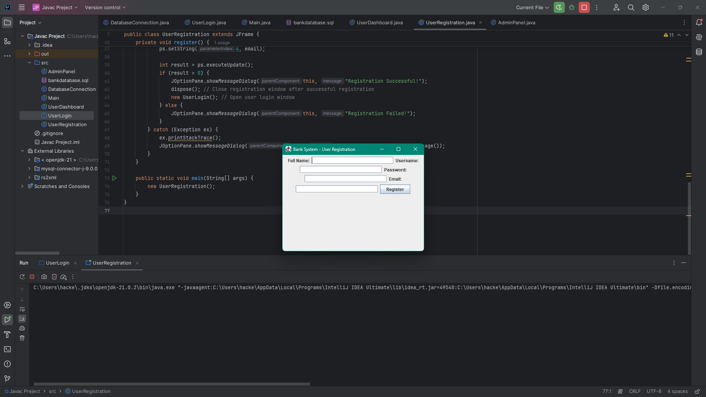
  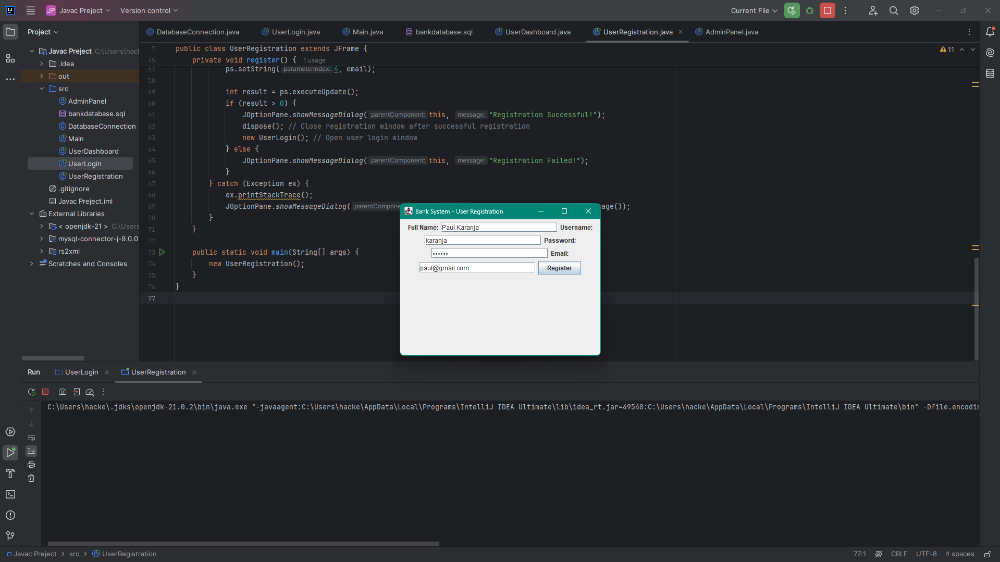
  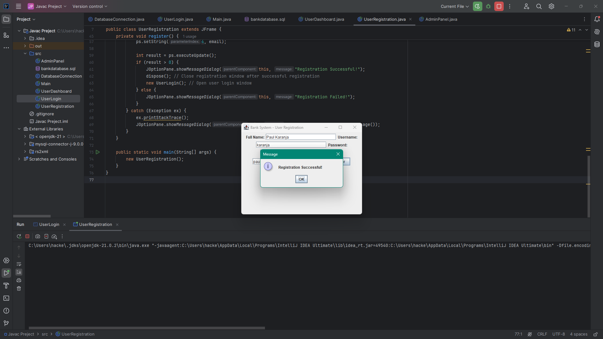
  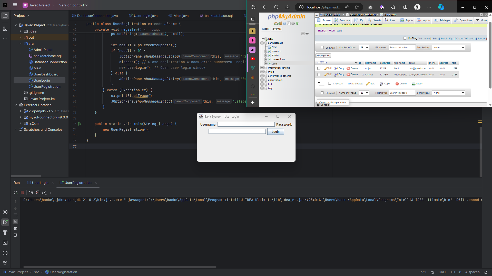

- **Database Management**: Data is stored in the Apache database, including user information, account balances, and transaction records.
  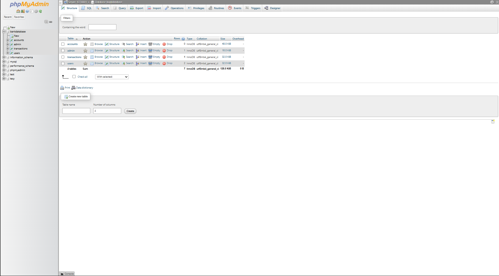
  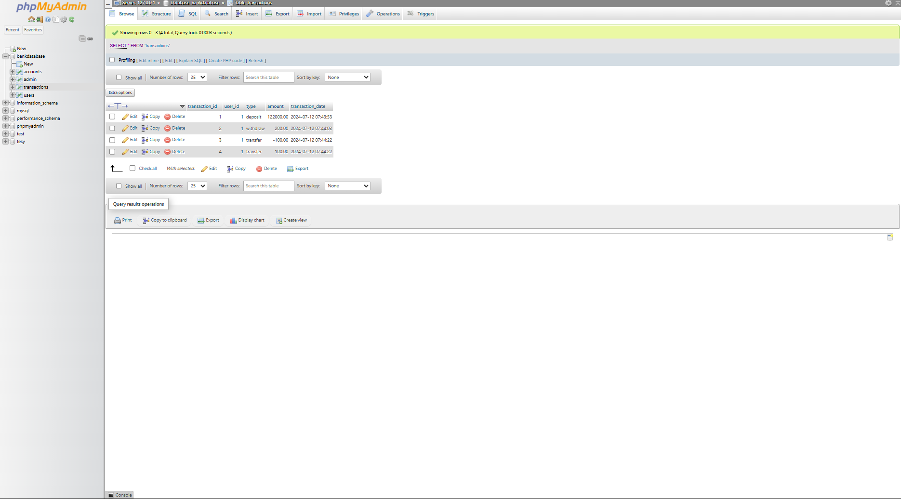
  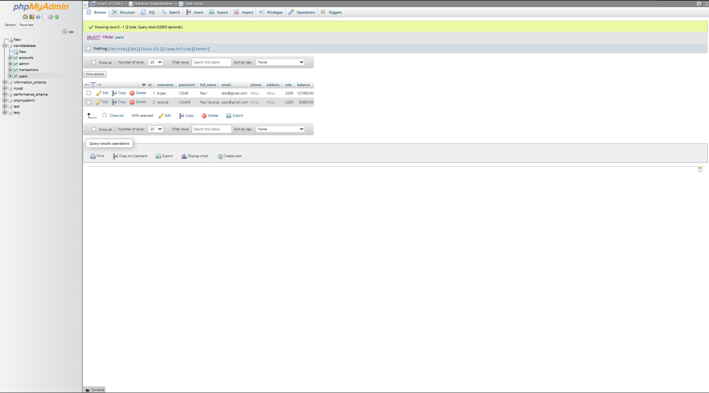

- **Automatic Balance Update**: User balances are automatically updated after each transaction.
  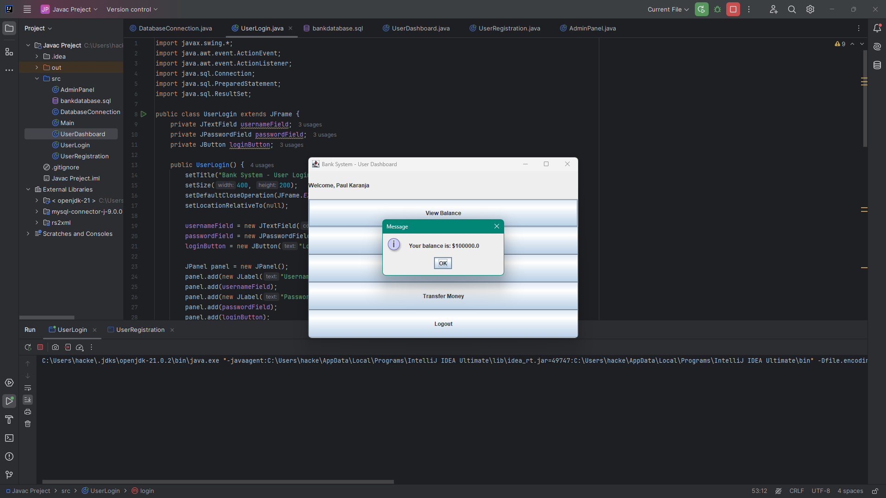

- **Withdraw Feature**: Users can withdraw money from their accounts.
  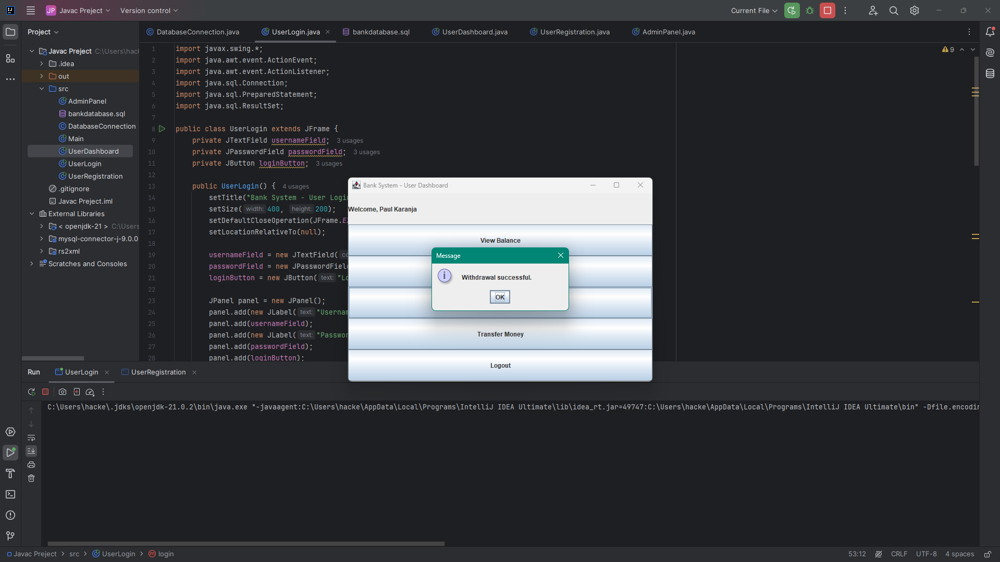
  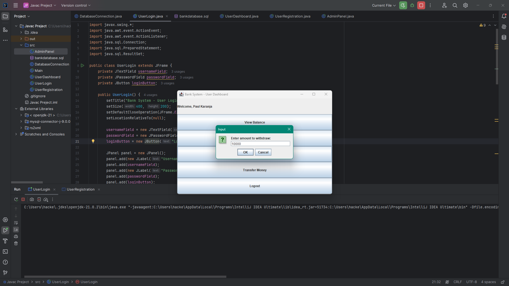
  

- **Admin Panel**: Admins can log in to manage user accounts and oversee transactions.
  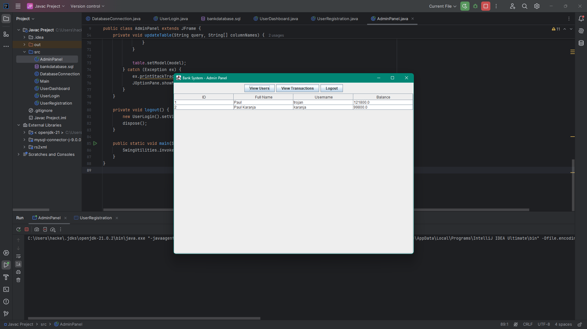
  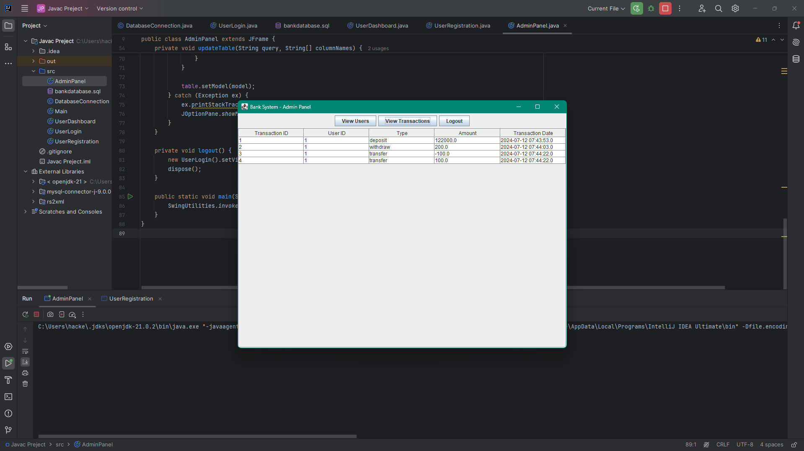

- **Deposit Feature**: Users can deposit money into their accounts.
  
  

- **Transfer Money Between Users**: Users can transfer money to other users' accounts.
  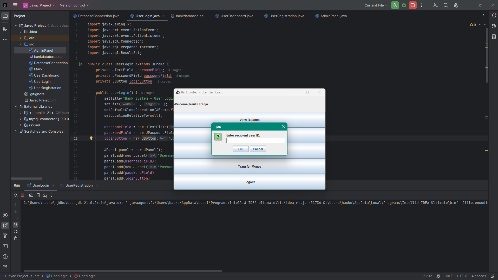
  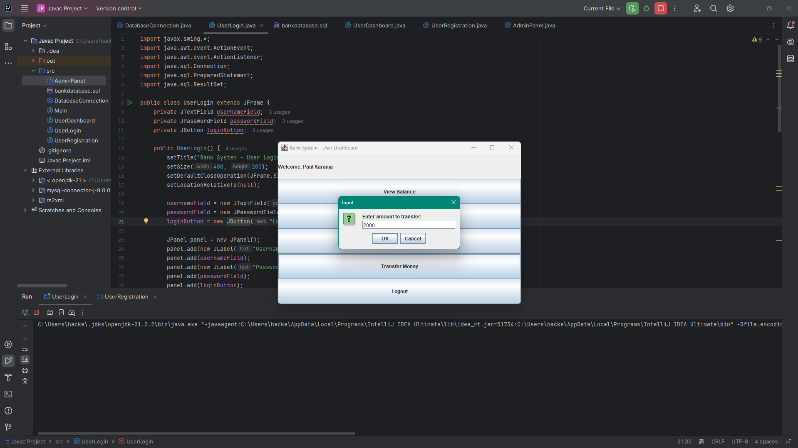
  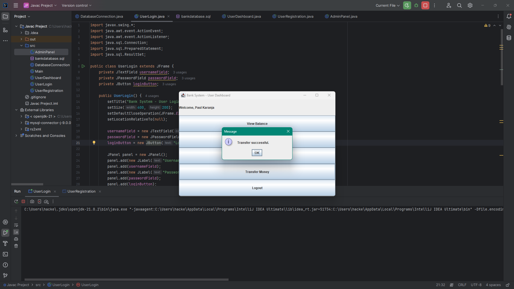

- **User Sign-In and Log Out**: Users can sign in to access their accounts and log out securely.
  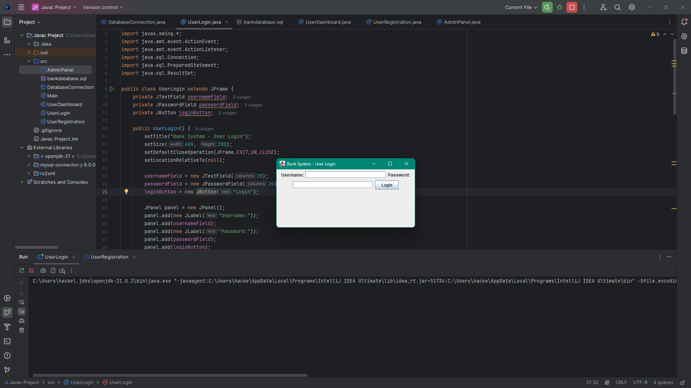
  

## Installation

1. Clone the repository:
   ```bash
   git clone https://github.com/yourusername/java-banking-system.git
   ```

2. Set up the MariaDB database using the provided SQL scripts.

3. Import the project into your Java IDE (e.g., IntelliJ IDEA).

4. Configure the database connection in the project.

5. Run the application.

## Usage

1. **Register** as a new user or log in if you already have an account.
2. **Manage your account** by checking your balance, making deposits, withdrawing money, or transferring funds.
3. **Admin access** allows overseeing user accounts and managing transactions.

## Contributing

Feel free to contribute to this project by submitting issues or pull requests. Any improvements or additional features are welcome!

## License

This project is licensed under the MIT License - see the [LICENSE](LICENSE) file for details.

---
